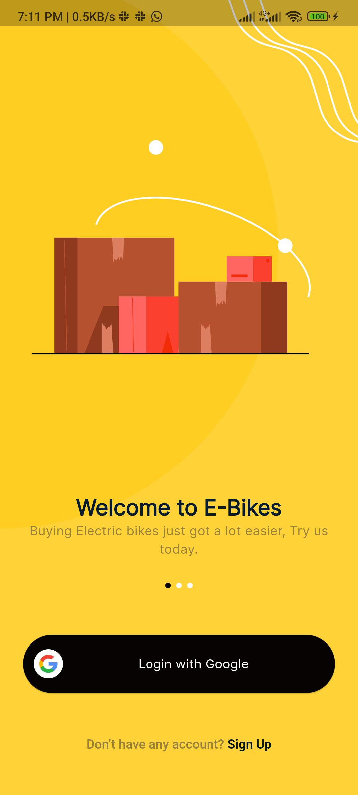
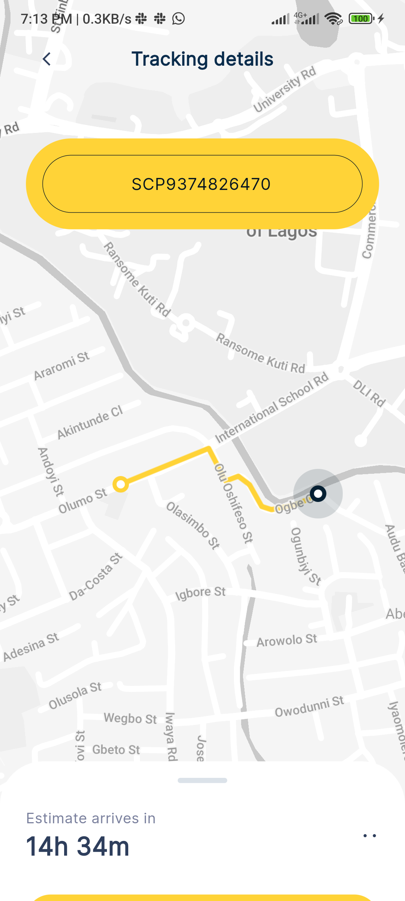

# Delivery App

A flutter project that shows a simple delivery app ui.

## Description

The delivery app is a simple flutter project that shows a delivery app ui. The app has a login screen, a home screen and
a tracking screen. The login screen has a login button that allows the user to login with google. The home
screen has a list of items that can be delivered. The tracking screen has a map that shows the location of the delivery.

## Features

- [x] Login with Google
- [x] Clean UI

## Screenshots

<table>
<tr>
<td valign="top" width="50%">

</td>
<td valign="top" width="50%">

</td>
</tr>

<tr>
<td valign="top" width="50%">

</td>
<td valign="top" width="50%">

</td>
</tr>

<tr>
<td valign="top" width="50%">

</td>
</tr>
</table>

## App Demo

The apk to the app can be found in the actions tab

## Installation

Clone the repository from Github:

``` bash
git clone https://github.com/logickoder/delivery-app.git
```

Navigate to the project directory:

``` bash
cd delivery-app
```

Get the project dependencies:

```bash
flutter pub get
```

Run the app on your emulator or physical device:

```bash
flutter run
```

## Requirements

- Flutter installed on your system
- Emulator or physical device for testing
- Firebase account

## Contributing

Contributions are welcome! Please feel free to fork the repository and submit pull requests. Make
sure to follow the existing code conventions and try to include tests with your changes.

## License

This project is licensed under the MIT License - see the LICENSE file for details.